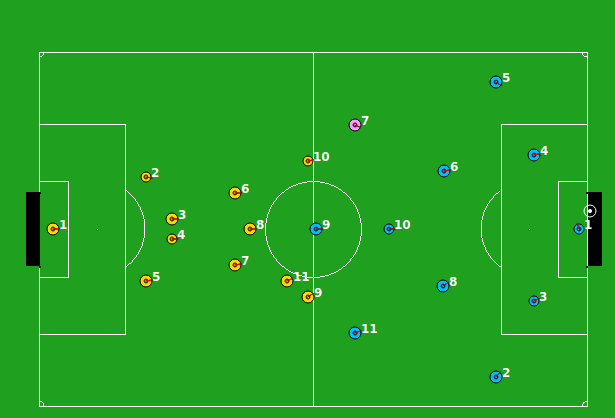

# ROBOCUB FC_Oesía
Nosotros somos:
- Andriana Dovhanych
- Andrés Medina 
- Aldo Lupio
- Francisco J. Carrasco

## Documentación y instalación
Es necesaria la instalación del monitor y el servido para la ejecución del código
- [Official RoboCup Soccer Simulator](https://rcsoccersim.github.io/)
- [Resources](https://github.com/rcsoccersim/)

## How to use it in Ubuntu
1. Iniciar el servidor
   ````C
   ./rcssserver
   ````
   
2. Iniciar el monitor
    ````C
   ./rcssmonitor
   ````
3. Iniciar el código jugador
    ````C
     mkdir build
     cd build
     cmake ..
     make
     cd ..
     chmod +x launch.sh
     ./launch.sh
   ````
## Fallos 
En Ubuntu 24.04 da un fallo por el gnome pero se soluciona añadiendo antes de la ejecucion esta línea de código
````c
unset GTK_PATH
````
## Descripción
Se trata de un partido de fútbol en el que diseñamos la estrategia de los jugadores, simulando un encuentro lo más parecido posible a uno real, incluyendo faltas y todos los elementos involucrados en un partido.

En la imagen a continuación, pueden ver el inicio de un partido, siendo nuestro equipo el de la izquierda.




